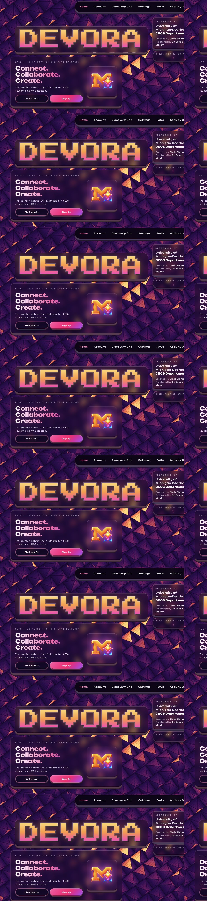

# Devora

**UofM Dearborn's own CECS Networking Hub**

Instagram-style social connection platform + institutional hub for CECS students at UM-Dearborn. Find collaborators, friends, project teammates, events, opportunities, and study groups within your engineering community.

---

## Overview

Devora is a **portfolio-based social discovery platform** for the College of Engineering and Computer Science (200-300 students).

**What it is:**
- **Not a swipe/match app.** Model is Instagram: follow people, they follow you back, you decide who collaborates with
- Browse CECS student profiles with portfolios (GitHub, LinkedIn, projects, tech stack, interests)
- Send connection requests → message if accepted → reduce social friction before in-person meetups
- Discover aligned collaborators, study partners, co-founders, mentors without cold-approach awkwardness
- Access CECS hub: events, clubs, opportunities, peer feedback, community activity in one place

**Who it's for:**
- CECS students (especially commuters/remote) who feel isolated and want to find their people
- First-gen students, transfer students, or anyone lacking confidence in campus networking
- Engineers looking for project teammates, study groups, hackathon partners, casual collaboration
- Students wanting to see what peers are building before committing to collaboration

---

## Homepage

Live landing page at `/home`.



---

## Tech Stack

- **Frontend:** Next.js 14, TypeScript, Tailwind CSS, React
- **Backend:** Firebase (Authentication, Firestore, Storage)
- **Deployment:** Vercel
- **Repository:** GitHub

---

## Project Status

**Current Phase:** Fall 2026 (ENGR 492 - Capstone Development) — Week 4

**Completed:**
- ✅ Infrastructure & GitHub repo (Week 1)
- ✅ Database schema designed (Week 2)
- ✅ UI/Design system + reusable components (Week 3)
- ✅ Authentication pages (sign up/login) (Week 4)

**In Progress:**
- 🔄 Discovery Grid with conditional rendering & Firestore filters (Week 5)
- 🔄 Profile creation & view pages (Week 5)
- 🔄 Institutional coordination (OSL, External Relations, ITS)

**Upcoming:**
- Week 6: Project portfolio system
- Week 7: Discovery page + multi-filter search (live demo)
- Week 8: Real-time messaging
- Week 9: Notifications + loading states + end-to-end demo
- Week 10: Baseline survey launch (20-30 CECS students)
- Week 11: Survey results & analysis
- Week 12: Final submission (documentation, clean repo, live deployment)

**Next Milestone:** Oct 12, 2026 (Discovery Grid live with Firestore queries)

---

## Installation

### Prerequisites
- Node.js 18+ (or newer)
- npm or yarn
- Firebase account
- GitHub account
- Vercel account (for deployment)

### Setup Steps

1. **Clone the repository**
   ```bash
   git clone https://github.com/CapChris20/devora.git
   cd devora
   ```

2. **Install dependencies**

   The Next.js app lives in the inner `devora` folder.
   ```bash
   cd devora
   npm install
   ```

3. **Set up environment variables**

   Create a `.env.local` file in that `devora` directory:
   ```
   NEXT_PUBLIC_FIREBASE_API_KEY=your_api_key
   NEXT_PUBLIC_FIREBASE_AUTH_DOMAIN=your_auth_domain
   NEXT_PUBLIC_FIREBASE_PROJECT_ID=your_project_id
   NEXT_PUBLIC_FIREBASE_STORAGE_BUCKET=your_storage_bucket
   NEXT_PUBLIC_FIREBASE_MESSAGING_SENDER_ID=your_sender_id
   NEXT_PUBLIC_FIREBASE_APP_ID=your_app_id
   ```

4. **Run the development server**
   ```bash
   npm run dev
   ```

   Open [http://localhost:3000](http://localhost:3000) in your browser. `/` redirects to `/home`.

   From the repo root you can also run `npm run dev`. That starts the same app.

---

## Project Structure

```
devora/                         # Next.js app
├── src/app/                    # Routes (home, auth, account, discovery, settings, FAQs)
├── src/ui/                     # Screens and shared components
├── src/backend/firebase/       # Auth, Firestore, Storage
├── src/docs/                   # Design scope, discovery grid, schema
├── public/                     # Logo and static assets
├── .env.local                  # Environment variables (not in git)
├── tailwind.config.ts
├── tsconfig.json
└── package.json
```

---

## Design System

Color Palette:
- **Background:** #1a0a2e (Deep Purple)
- **Primary Accent:** #FFD700 (Gold)
- **Secondary Accent:** #FF006E (Neon Pink)
- **Interactive:** #00D9FF (Cyan)
- **Text:** #ffffff (White)

**Gradient Cycles (4 Devora Gradients):**
- `logo-gradient` — Primary brand gradient
- `devora-gradient-text` — Secondary text gradient
- `pink-grad` — Accent pink gradient
- `headline-grad` — Headline text gradient

Full design specs and the Discovery Grid plan: [devora/src/docs/DESIGN_SCOPE.md](devora/src/docs/DESIGN_SCOPE.md). Conditional rendering for the grid is in [devora/src/docs/discovery-grid.md](devora/src/docs/discovery-grid.md).

---

## UI Architecture: Conditional Rendering

### Discovery Grid

State-driven conditional rendering of child components. Filters are on the live page. Student cards and the profile peek are built, and they are not mounted yet. See the design scope before wiring them to Firestore.

| Component | Render Logic | Status |
|-----------|--------------|--------|
| **Filter Sidebar** | Show/hide via toggle; left glass panel overlay (not sticky) | ✅ Complete |
| **Search Input** | Gold search icon; debounce for Firestore text search | ✅ Complete |
| **Filter Pill Sections** | Map over filter categories; show/hide based on the selected-filters state | ✅ Complete |
| **Profile Card Grid** | Show a loading or empty state while the query runs; show cards only when results exist | Not mounted yet |
| **Profile Peek Sheet** | Portal to `document.body` (z-index 240); render only when a card in the current results is selected | Not mounted yet |
| **Active Pill Styling** | Conditional active class when a filter is selected | ✅ Complete |
| **Clear Filters Button** | Show only when at least one filter is selected | ✅ Complete |

**Key Patterns:**
- Filter state lives in `devora/src/ui/discovery/DiscoveryGridContent.tsx`
- Filters overlay is a left glass panel with a sharp background (no `backdrop-filter` blur)
- Profile peek portals above the navbar and footer so the footer cannot paint over it
- Hide a student when onboarding is unfinished, the profile is not public, the account is deactivated, or the viewer is looking at their own profile

### Hub (5 Discord-Style Channels)

Conditional rendering of channel content with state-driven tab navigation:

| Channel | Purpose | Status |
|---------|---------|--------|
| **#Messages** | 1-on-1 + group conversations with connections | Shell (Week 8) |
| **#Collaborate** | "I'm looking for..." posts (teammates, study partners, co-founders, mentors) + others reply/join | Shell (Week 7-8) |
| **#Showcase** | Share projects, portfolio pieces, WIP + get peer feedback + rating system | Shell (Week 9) |
| **#Events** | CECS institutional events (VictorsLink/OSL) + calendar view + RSVP | Shell (Week 7) |
| **#Clubs** | List of CECS clubs/teams/orgs with links to join | Shell (Week 7) |

**Key Patterns:**
- Channels will be managed by an active-channel state so only the open channel renders
- Channel labels cycle through the four Devora gradients
- #Messages and #Collaborate drive the core collaboration value
- #Events and #Clubs bring institutional resources into the peer network

---

## Features

### Core Platform (Fall 2026 ENGR 492)
- [x] Infrastructure & setup (Week 1)
- [x] Firestore schema design (Week 2)
- [x] UI/Design system & reusable components (Week 3)
- [x] Authentication with Michigan school email restriction (Week 4)
- [ ] Student profiles with portfolio (major, year, bio, skills, GitHub, LinkedIn, interests) (Week 5)
- [ ] Project portfolio (create, edit, display projects with tech stack & GitHub links) (Week 6)
- [ ] Discovery Grid with multi-filter search (tech stack, major, course, collab goal) (Week 5-7)
- [ ] Connection system (follow/connect users, connection requests, accept/reject) (Week 7)
- [ ] Real-time messaging (1-on-1 + group conversations) (Week 8)
- [ ] Hub with 5 channels (#Messages, #Collaborate, #Showcase, #Events, #Clubs) (Week 7-9)
- [ ] Notifications, loading states, empty states, mobile responsiveness (Week 9-10)
- [ ] Baseline survey (20-30 CECS students pre-use) (Week 10-11)

### Winter 2027 (ENGR 493)
- [ ] Pilot launch (20-30 CECS students)
- [ ] User research & baseline survey
- [ ] Feature iteration based on feedback
- [ ] Final analysis & report

---

## Database Schema

Student profiles live on one Firestore document per person: `users/{uid}`. Projects and notifications are subcollections under that document. Profile photos are stored at `users/{uid}/avatar.*`.

See [devora/src/docs/firestore-schema.md](devora/src/docs/firestore-schema.md) for the field list.

---

## Authentication

- Google sign-in through Firebase Authentication
- Restricted to `@umich.edu` and `@umd.umich.edu`
- Sign-in sends unfinished profiles to onboarding, deactivated accounts to the deactivated screen, and finished profiles to the Discovery Grid

---

## Deployment

### Deploy to Vercel

1. Push code to GitHub
2. Connect repo to Vercel (vercel.com)
3. Add environment variables in Vercel settings
4. Vercel auto-deploys on each push to main branch

**Live URL:** `https://cecs-connect.vercel.app` (once deployed)

---

## Contributing

This is a capstone project. Contributions welcome during development phase.

For bugs or feature requests, create an issue on GitHub.

---

## Faculty & Advisor

- **Student:** Christian Shina (chrishin@umich.edu)
- **Advisor:** Dr. Bruce Maxim (bmaxim@umich.edu)
- **University:** University of Michigan – Dearborn
- **Program:** College of Engineering and Computer Science (CECS)

---

## License

This project is part of an academic capstone and is not currently open-sourced.

---

## Institutional Coordination (Fall 2026)

**Key Contacts & Approval Channels:**

1. **Mridula Divakar** — Student Organization Coordinator (Office of Student Life)
   - Email: mridulad@umich.edu
   - Purpose: Events integration (VictorsLink → Rubric API) & student org outreach

2. **External Relations Communications** — CECS Department
   - Channel: Request form via https://umdearborn.edu/academic-success/success-dearborn/
   - Purpose: Survey distribution, baseline user outreach (20-30 CECS students)

3. **ITS (Information Technology Services)**
   - Channel: Service request via https://umdearborn.edu/it/support/
   - Purpose: Data feed integration, FERPA compliance, Firestore vs institutional hosting

**Timeline:**
- Week 5 (Oct 7-13): Submit outreach requests to all three channels
- Week 10 (Nov 18-24): Launch baseline survey with 20-30 CECS students
- Week 11 (Nov 25-Dec 1): Collect survey data and analyze results

---

## Resources

- [Next.js Documentation](https://nextjs.org/docs)
- [Firebase Documentation](https://firebase.google.com/docs)
- [Tailwind CSS Documentation](https://tailwindcss.com/docs)
- [TypeScript Documentation](https://www.typescriptlang.org/docs/)
- [GitHub Repository](https://github.com/CapChris20/devora)

---

## Status

Last Updated: October 6, 2026

For weekly check-ins and progress updates, see `docs/check-in-1.md` or contact the advisor.
