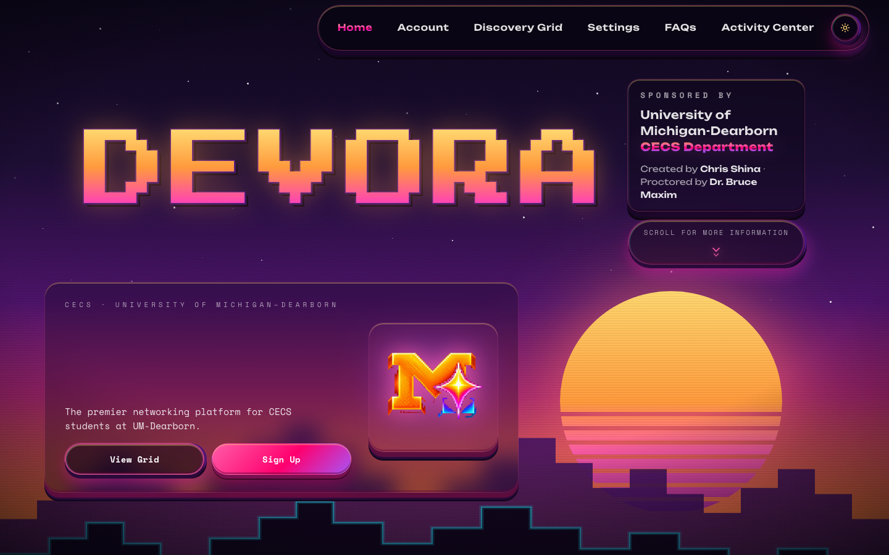
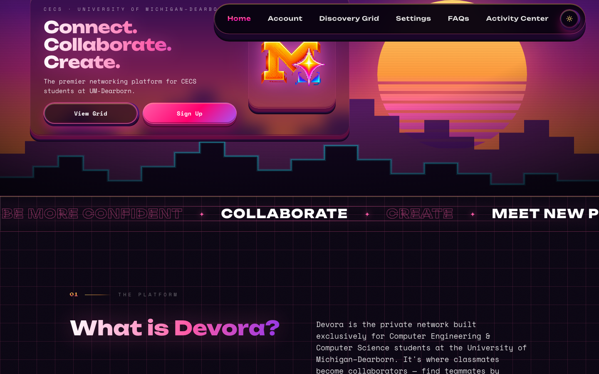
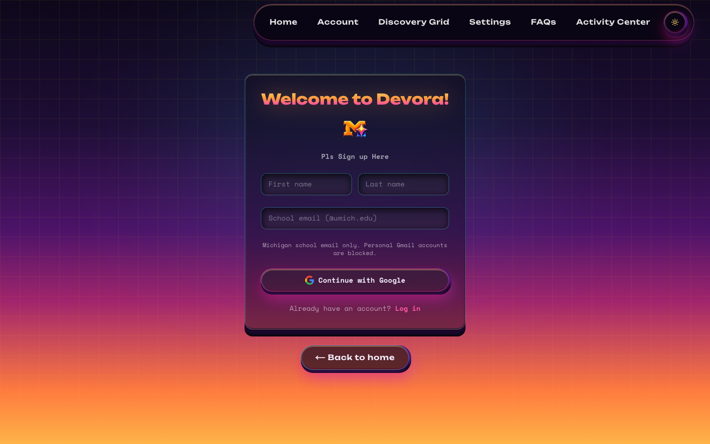
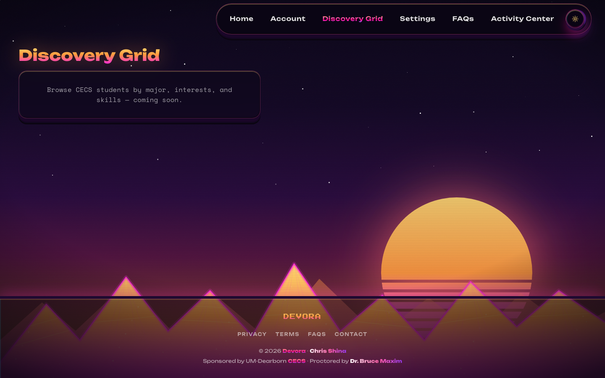
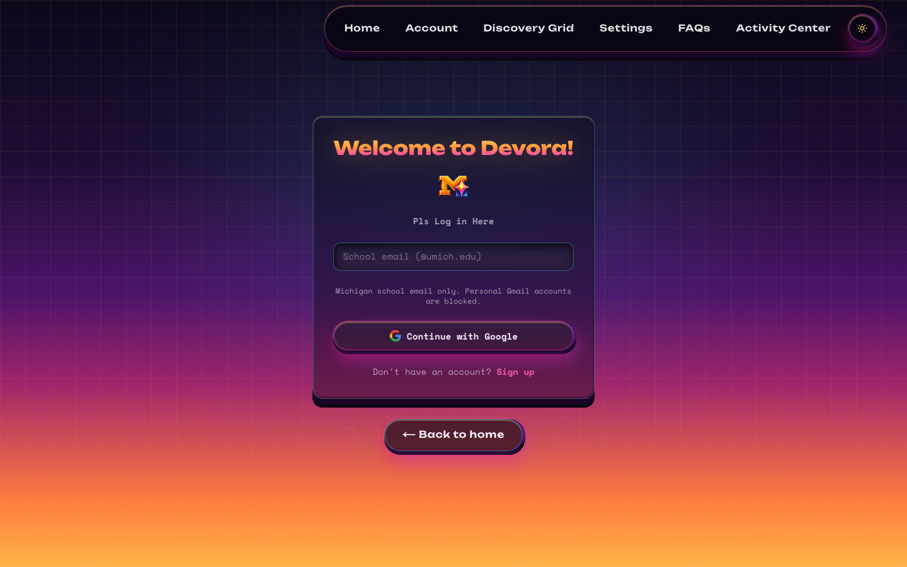
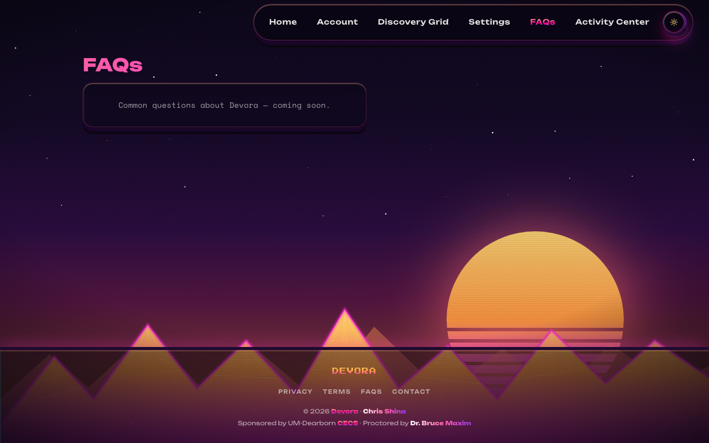
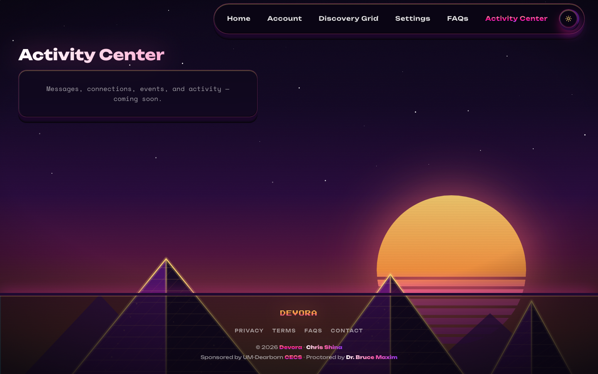

# Devora — Check-in #1 (Week 1–2)

**Date:** September 9, 2026  
**Student:** Christian Shina (chrishin@umich.edu)  
**Advisor:** Dr. Bruce Maxim (bmaxim@umich.edu)  
**Course:** ENGR 492 — Capstone Development, Fall 2026  
**University:** University of Michigan – Dearborn, CECS

---

## 1. What Have You Done in the Past Two Weeks?

### Infrastructure Setup

| Deliverable | Status | Notes |
|-------------|--------|-------|
| Next.js 14 + TypeScript + Tailwind CSS | ✓ Complete | App scaffolded with App Router; custom `dev.mjs` / `build.mjs` scripts |
| GitHub repository | ✓ Complete | Monorepo-style layout with `devora/` app folder |
| Firebase project | ✓ Complete | Auth, Firestore, Storage configured; `firebase.json`, `firestore.rules`, `storage.rules` |
| Firebase client integration | ✓ Complete | `src/backend/firebase/` — auth, user profiles, storage upload, usage tracking |
| Vercel deployment | 🟡 In progress | GitHub repo linked; production URL not yet assigned (`devora.vercel.app` is taken by another project) |
| Environment configuration | ✓ Complete | `.env.example` → `.env.local` pattern for `NEXT_PUBLIC_FIREBASE_*` keys |

**Repository:** [https://github.com/CapChris20/devora](https://github.com/CapChris20/devora)  
**Live deployment:** Not yet deployed — local dev at `http://localhost:3000/home`

---

### Design Work

| Deliverable | Status | Notes |
|-------------|--------|-------|
| Synthwave visual identity | ✓ Complete | Dark glass aesthetic, four Devora gradient variants defined in `globals.css` |
| Retro background scenes | ✓ Complete | Peaks, City, and Pyramids scenes via `PageLayout` |
| Homepage (hero + sections) | ✓ Complete | Full landing at `/home` — hero, feature cards, four steps, join section, Lottie animations |
| Design system documentation | ✓ Complete | `DESIGN_SCOPE.md` — colors, typography, surfaces, page specs, anti-patterns |
| Landing copy spec | ✓ Complete | `landing-sections-spec.md` |
| Nav + theme toggle | ✓ Complete | Glass pill navbar, dark/light mode via `ThemeProvider` |
| Shell pages (4 routes) | 🟡 In progress | Discovery Grid, Settings, FAQs, Activity Center — gradient title + retro bg + coming-soon copy |
| Account page UI | ✓ Complete | View + edit profile, discovery preview, profile strength bar |
| Auth / onboarding UI | ✓ Complete | Login, signup, 5-step onboarding, welcome screen |

**Screenshots** *(captured Sep 2, 2026 via Playwright — see `assets/`)*

#### Homepage

#### Authentication

#### Shell Pages (coming soon)

---

### Documentation Created

| Document | Status | Purpose |
|----------|--------|---------|
| Root `README.md` | ✓ Complete | Project overview, tech stack, install steps, timeline |
| `devora/README.md` | ✓ Complete | App-level README with doc index |
| `DESIGN_SCOPE.md` | ✓ Complete | UI design bible — live vs shell, page specs, gradient mapping |
| `firestore-schema.md` | ✓ Complete | User profile fields, onboarding map, Discovery Grid card fields |
| `mobile-app-roadmap.md` | ✓ Complete | Weeks 10–13 plan (PWA, Capacitor iOS, push, App Store) |
| `naming-and-structure.md` | ✓ Complete | Folder layout, routes, file naming conventions |
| `landing-sections-spec.md` | ✓ Complete | Homepage copy below the hero |
| `reading-the-code.md` | ✓ Complete | Symbol glossary for codebase readability |
| `comment-style.md` | ✓ Complete | Comment conventions for `src/` |
| Cursor rules (`.cursor/rules/`) | ✓ Complete | Agent guidance pointing to design + naming docs |

---

### Feature Progress (Ahead of Schedule)

Several Week 4+ items were started early during infrastructure work:

| Feature | Status | Notes |
|---------|--------|-------|
| Google Auth (`@umich.edu` only) | ✓ Complete | Popup sign-in with domain validation |
| Signup + login pages | ✓ Complete | `/auth/login`, `/auth/signup` |
| 5-step onboarding | ✓ Complete | Major, interests, bio, socials → Firestore |
| User profile (read/write) | ✓ Complete | `users/{uid}` with avatar upload to Storage |
| Account page | ✓ Complete | View mode, edit mode, sign out |
| Settings page | 🟡 Shell only | Layout + title; toggles not wired |
| Discovery Grid | 🟡 Shell only | Route exists; filters + profile cards not built |
| Activity Center / Messaging | 🟡 Shell only | Route exists; tabs + threads not built |
| FAQs | 🟡 Shell only | Route exists; accordion content not rebuilt |

---

## 2. What Will You Do in the Next Two Weeks?

**Focus:** Week 3 (UI / design system completion) → Week 4 (core feature kickoff)

### Priority Order

1. **Discovery Grid** — filter sidebar, profile cards, Firestore queries *(highest priority — core product value)*
2. **Settings page** — wire toggles to Firestore `settings` subdoc + `ThemeProvider`
3. **FAQs page** — rebuild accordion with all 16 items from `DESIGN_SCOPE.md`
4. **Protected routes** — redirect unauthenticated users from Discovery, Settings, Account, Activity Center
5. **Vercel deployment** — confirm production build, env vars, and share live URL with advisor

---

### Week 3 Deliverables (Sep 9 – Sep 15)

| Milestone | Deliverable | Target |
|-----------|-------------|--------|
| Design system | Rebuild shared page components (`page-panel`, `glass-card`, pills, search) per `DESIGN_SCOPE.md` | Sep 12 |
| Discovery Grid | Filter sidebar with 8 pill sections + mock or live profile grid | Sep 14 |
| Settings | Appearance toggle wired; at least 2 preference cards functional | Sep 15 |
| Deployment | Vercel live URL confirmed and added to README | Sep 15 |

---

### Week 4 Deliverables (Sep 16 – Sep 22)

| Milestone | Deliverable | Target |
|-----------|-------------|--------|
| Discovery Grid | Firestore-backed profile cards with compound filters | Sep 19 |
| FAQs | All 16 accordion items with search + category pills | Sep 20 |
| Activity Center | Messages tab — conversation list + thread UI (mock data OK) | Sep 22 |
| Auth guards | Middleware or client-side redirect for protected routes | Sep 22 |

---

### Milestones Summary

| Date | Milestone |
|------|-----------|
| Sep 15, 2026 | Week 3 check-in — Discovery Grid + Settings demo-ready |
| Sep 22, 2026 | Week 4 check-in — FAQs + Activity Center shell + live Firestore discovery |
| Dec 9, 2026 | Final submission (ENGR 492) |

---

## 3. What Are Your Obstacles?

### Technical Blockers

| Obstacle | Impact | Plan to Resolve |
|----------|--------|-----------------|
| Discovery Grid Firestore queries | 🔴 Blocked | Compound filters on arrays (`careerNiche`, `casualInterests`) need index design; review `firestore-schema.md` filter fields and create composite indexes in Firebase Console before Week 4 |
| FAQ answer copy | 🟡 In progress | Full answer text was removed with old mock-data; rewrite from `DESIGN_SCOPE.md` question list or recover from git history |
| Protected route strategy | 🟡 In progress | Decide Next.js middleware vs client-side `onAuthStateChanged` guard — implement in Week 4 |
| Production env vars on Vercel | 🟡 In progress | Ensure all `NEXT_PUBLIC_FIREBASE_*` keys are set in Vercel dashboard; test `npm run build` locally first |

### Time Management

| Obstacle | Impact | Plan to Resolve |
|----------|--------|-----------------|
| Scope ahead of timeline | 🟡 In progress | Auth + account shipped early; re-prioritize shell pages over polish on homepage animations |
| Capstone + other courses | 🟡 In progress | Block 2–3 focused dev sessions per week; use `DESIGN_SCOPE.md` as rebuild checklist to avoid rework |

### Design / Scope Decisions Pending

| Decision | Impact | Plan to Resolve |
|----------|--------|-----------------|
| Mock data vs live Firestore for Discovery Grid v1 | 🟡 In progress | Propose: mock profiles for Week 3 UI demo, Firestore queries for Week 4 — confirm with Dr. Maxim at check-in |
| Skills / tech stack on profile | 🟡 Deferred | Marked deferred in `DESIGN_SCOPE.md`; revisit after core discovery works |
| Email/password auth | 🟡 Deferred | Google-only for v1; email/password helpers exist in `auth.ts` for future use |

### External Blockers

| Obstacle | Impact | Plan to Resolve |
|----------|--------|-----------------|
| Firebase billing / quota | 🟡 Monitor | Stay on Spark plan; usage tracking in `usage-tracking.ts` |
| Vercel deployment access | 🟡 In progress | `devora.vercel.app` is occupied by another project; need a unique Vercel subdomain (e.g. `devora-cecs.vercel.app`) before Week 3 check-in |
| CECS pilot user access | 🟡 Future | Not needed until Winter 2027 (ENGR 493 pilot); document access policy in FAQs |

---

## Progress Metrics

| Deliverable | Week 1 | Week 2 | Status |
|-------------|--------|--------|--------|
| Next.js + TypeScript setup | 🟡 | ✓ | ✓ Complete |
| GitHub repository | ✓ | ✓ | ✓ Complete |
| Firebase (Auth, Firestore, Storage) | 🟡 | ✓ | ✓ Complete |
| Vercel deployment | — | 🟡 | 🟡 In progress |
| Design system docs | — | ✓ | ✓ Complete |
| Homepage (live) | 🟡 | ✓ | ✓ Complete |
| Firestore schema design | — | ✓ | ✓ Complete |
| Google Auth + onboarding | — | ✓ | ✓ Complete |
| Account page | — | ✓ | ✓ Complete |
| Discovery Grid | — | 🟡 | 🟡 Shell only |
| Settings page | — | 🟡 | 🟡 Shell only |
| FAQs page | — | 🟡 | 🟡 Shell only |
| Activity Center | — | 🟡 | 🟡 Shell only |
| Real-time messaging | — | — | 🔴 Not started |

**Legend:** ✓ Complete · 🟡 In progress · 🔴 Blocked / not started

---

## Links & References

| Resource | URL |
|----------|-----|
| GitHub repository | [https://github.com/CapChris20/devora](https://github.com/CapChris20/devora) |
| Vercel deployment | Not yet deployed |
| Local dev server | `http://localhost:3000/home` |
| Design scope | `devora/src/docs/DESIGN_SCOPE.md` |
| Firestore schema | `devora/src/docs/firestore-schema.md` |
| Mobile roadmap | `devora/src/docs/mobile-app-roadmap.md` |
| Screenshot assets | `assets/` (9 PNGs — homepage, auth, shell pages) |

---

## Questions for Dr. Maxim

1. **Discovery Grid v1 scope:** Is mock profile data acceptable for the Week 3 demo, with live Firestore integration targeted for Week 4?
2. **Pilot timeline:** When should we begin recruiting CECS students for user testing — Fall 2026 or Winter 2027 (ENGR 493)?
3. **Deployment review:** Preferred format for sharing progress — live Vercel URL, Loom walkthrough, or in-meeting demo?
4. **Feature priority:** Should Activity Center (messaging UI) or Discovery Grid (search/filters) take precedence if Week 4 scope needs trimming?
5. **[ADD YOUR QUESTION HERE]**

---

*Generated: September 9, 2026 · Devora ENGR 492 Check-in #1*
